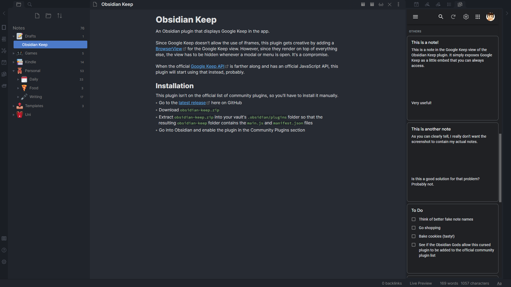
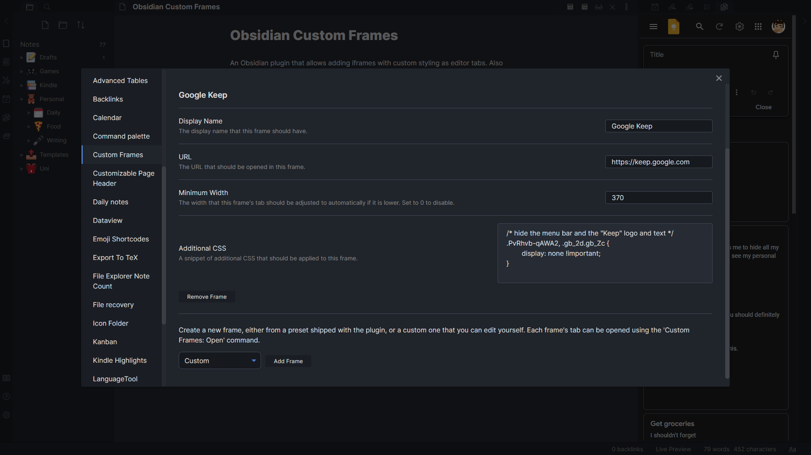

# Obsidian Custom Frames
An Obsidian plugin that allows adding iframes with custom styling as editor tabs. Also comes with presets for Google Keep and more.

## Usage
To use this plugin, simply go into its settings and add a new frame, either from a preset shipped with the plugin, or a custom one that you can edit yourself. Each frame's tab can be opened using the 'Custom Frames: Open' command.

Note that this plugin only works on Desktop right now.

## Presets
By default, Custom Frames comes with a few presets that allow you to get new tabs for popular sites up and running quickly.
- Google Keep, optimized for a narrow side tab

If you create a frame that you think other people would like, don't hesitate to create a pull request with [a new preset](https://github.com/Ellpeck/ObsidianCustomFrames/blob/master/main.ts#L8).

## Roadmap
- Allow setting a custom icon for each tab
- Allow displaying custom frames in Markdown code blocks
- Possibly allow executing custom JavaScript in iframes (though security implications still need to be explored)

## Acknowledgements
Thanks to [lishid](https://github.com/lishid) for their help with making iframes work in Obsidian for a purpose like this. Also thanks to them for *motivating* me to turn Obsidian Keep into a more versatile plugin, which is how Custom Frames was born.

If you like this plugin and want to support its development, you can do so via [my website](https://ellpeck.de/support). Thanks!